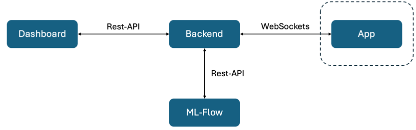

# MLFLOW-App
Anwendung zum Deployen und Ausführen eines YoloV7 Modells auf Edge Devices direkt im Webbrowser. 

Pakete installieren:`npm install`

Starten:`npm run dev`

Architektur: 

Features:
- **Echtzeit-Objekterkennung mit Webcam**: Verwendung einer Webcam für die Objekterkennung in Echtzeit durch Laden und Ausführen eines YOLOv7 Modells.
- **Objekterkennung mit YOLOv7**: Nutzung des YOLOv7-Modells für die Objekterkennung
- **Benutzerdefinierte Metrikübertragung**: Übertragung benutzerdefinierter Metriken (z.B. durchschnittliche Farbwerte im Bild) an das Backend über Websockets.
- **Dynamische Modellaktualisierungen**: Möglichkeit, Modellversionen über Websockets zu aktualisieren, ohne die Seite neu laden zu müssen.
- **Dunkelmodus-Umschaltung**: Umschaltung zwischen Dunkelmodus und Normalmodus basierend auf vom Backend gesendeten Befehlen.
- **Client-Registrierung und -Identifikation**: Automatische Registrierung und Speicherung einer Client-ID für die Identifikation in der Kommunikation mit dem Backend.

Fork von: [hugozanini/yolov7-tfjs](https://github.com/hugozanini/yolov7-tfjs).